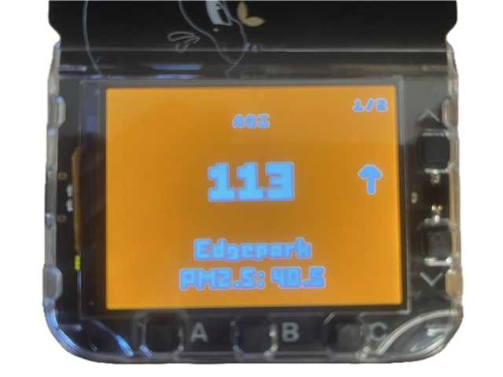
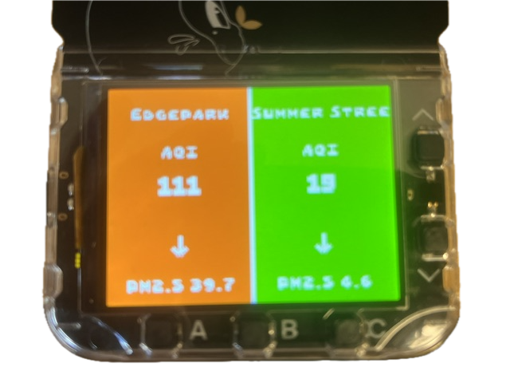

# Air Quality Monitor — Universe 2025 Badge App

A MonaOS MicroPython app for the Universe 2025 (Tufty) badge that shows the
current outdoor air quality from a [PurpleAir](https://www.purpleair.com/) sensor.

- While joining WiFi it shows **"Connecting to WIFI"**.
- Once connected it reads a configurable PM2.5 field (default `pm2.5_60minute`)
  from the PurpleAir v1 API, applies the **US EPA (Barkjohn) correction**, and
  converts it to a **US EPA AQI** number.
- The **entire screen** is filled with the AQI category color and the AQI number
  is printed large in **white**, with the corrected PM2.5 value shown below it.
- A **trend arrow** on the right of the AQI row shows whether the reading went
  **up**, **down**, or **stayed the same** vs. the previous reading (blank on the
  first reading).
- It refreshes on a configurable interval (default every 10 minutes).

> To match the PurpleAir map's "US EPA AQI" layer, the app applies the EPA
> correction `PM = 0.524·pm − 0.0862·humidity + 5.75` and lets you pick the
> averaging window via `PM_FIELD` (e.g. `pm2.5_1week` matches map links with
> `p604800`). Set `APPLY_EPA_CORRECTION = False` for raw, uncorrected AQI.

Based on the color/level/data-source approach of the Arduino
[PurpleTheopolis](https://github.com/jeff-luszcz/PurpleTheopolis) sketch.

## Screenshots

| Single sensor | Split view (two sensors) |
|---------------|--------------------------|
|  |  |

## Setup

1. **Install the app** — copy the `air_quality/` folder to `/system/apps/air_quality/`
   on the badge.

2. **WiFi credentials** — edit the badge's root-level `secrets.py` and fill in
   your network:
   ```python
   WIFI_SSID = "YourNetworkName"
   WIFI_PASSWORD = "YourPassword"
   ```

3. **Configure the sensor IDs** — edit the top of `air_quality/__init__.py`:
   - `PURPLE_AIR_SENSOR` — your station ID. On the PurpleAir map (See https://map.purpleair.com/air-quality-standards-us-epa-aqi ) , click a sensor,
     choose *"Get This Widget"*, and use the number from `PurpleAirWidget_12345`
     (e.g. `12345`).
   - `PURPLE_AIR_SENSOR_2` — optional second station ID. Leave as `""` to show
     only one sensor. When set, press **UP/DOWN** to cycle between the two
     sensors (a `1/2` page indicator appears in the top-right).
   - `PURPLE_AIR_API_KEY` — a READ key from https://develop.purpleair.com/keys.
     **Keep this secret.**
   - `REFRESH_SECONDS` — how often to refresh, in seconds (default `600` = 10 min).
   - `PM_FIELD` — which PM2.5 averaging window to read (default `pm2.5_60minute`;
     use `pm2.5_1week` to match a map link containing `p604800`).
   - `APPLY_EPA_CORRECTION` — `True` to match the map's "US EPA AQI" layer.

## Colors (US EPA AQI categories)

| AQI      | Category                       | Color     |
|----------|--------------------------------|-----------|
| 0–50     | Good                           | Green     |
| 51–100   | Moderate                       | Yellow    |
| 101–150  | Unhealthy for Sensitive Groups | Orange    |
| 151–200  | Unhealthy                      | Red       |
| 201–300  | Very Unhealthy                 | Purple    |
| 301+     | Hazardous                      | Maroon    |

## Controls

- **A** — reload the current sensor now and reset the refresh timer.
- **B** — toggle the **split view** that shows both sensors side-by-side (left =
  sensor 1, right = sensor 2, smaller fonts). Only active with a second sensor.
- **UP / DOWN** — cycle between sensors in single view (only when
  `PURPLE_AIR_SENSOR_2` is set).
  A sensor's data is fetched the first time it's shown, then reused until the
  shared refresh timer is due (a single timer covers both sensors).
- **HOME** — exit back to the MonaOS menu.

## Testing

- **Simulator** (from the [badger/home](https://github.com/badger/home) repo):
  place a `badge/secrets.py` with your WiFi values and run the app; the simulator
  proxies network requests through your computer.
- **On device**: `mpremote run air_quality/__init__.py`

## Notes

- Press **HOME** on back of Badge to exit back to the MonaOS menu.
- WiFi connection and data fetching are non-blocking (driven each frame by
  `io.ticks`), so the UI stays responsive.
  
## License
  
SPDX-License-Identifier: MIT
  
